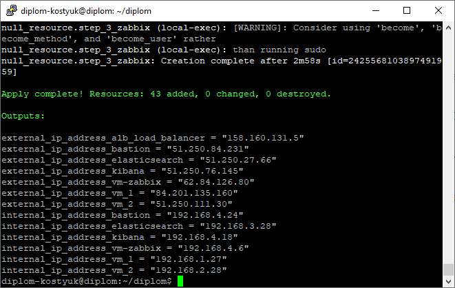

#  Дипломная работа по профессии «Системный администратор» - Денис Костюк

Содержание
==========
* [Введение](#Введение)
* [Задача](#Задача)
* [Инфраструктура](#Инфраструктура)
    * [Сайт](#Сайт)
    * [Мониторинг](#Мониторинг)
    * [Логи](#Логи)
    * [Сеть](#Сеть)
    * [Резервное копирование](#Резервное-копирование)
    * [Дополнительно](#Дополнительно)
* [Выполнение работы](#Выполнение-работы)
* [Критерии сдачи](#Критерии-сдачи)
* [Как правильно задавать вопросы дипломному руководителю](#Как-правильно-задавать-вопросы-дипломному-руководителю) 

---------
## Введение
Как это все работает:  
На сервисе Yandex Cloud создана виртуальная машина, на которой установлены Terreform и Ansible, а также размещены файлы проекта для развертывания инфраструктуры из дипломного задания. Эта виртуальная машина работает постоянно и непрерывно, поэтому доступ к ней есть всегда. Дипломный руководитель при проверке дипломного задания может командой terraform destroy удалить инфраструктуру, а командой terraform apply запустить создание инфраструктуры "с нуля".
Доступ к виртуальной машине, с которой разворачивается инфраструктура из дипломного задания:  
ip = 51.250.69.216  
user = diplom-kostyuk  
pass = пароль в целях безопасности отправлен в сопроводительном сообщении к ссылке на результат дипломной работы  
Интерфейс командной строки Yandex Cloud (CLI) не подключен  
  
Разворачивание инфраструктуры полностью автоматизировано, включая настройку конфигурационных файлов. Руками надо настраивать только ту часть, которая настраивается через WEB-интерфейс, а именно: Kibana и Zabbix.  
Пароль от БД Zabbix = 123456  
IP-адреса хостов (как внутренние, так и внешние) выводятся в аутпутах по результатам отработки проекта.  

Итак, подключаемся к серверу с проектом по учетным данным, приведенным выше:  

Далее идем в директорию diplom и запускаем команду terraform apply:

  
Далее yes:  

  
Через какое-то время проект отработает, на выходе в аутпутах получаем IP-адреса созданных хостов:  

  
Подключаться к серверам можно по внутренним IP через бастион пользователем user. Например, для подключения к WM-1 (виртуальная машина №1) можно испоьзовать команду: ssh -i ~/.ssh/id_rsa -J user@51.250.13.118 user@192.168.1.29, где "51.250.13.118" - это внешний IP-адрес бастиона, а "192.168.1.29" - это внутренний адрес хоста, к которому надо подключиться.  

Далее настраиваем Kibana и Zabbix через вэб-интерфейс.  

После этого переходим к демонстрации непосредственно к дипломной работы:  

## Задача
Ключевая задача — разработать отказоустойчивую инфраструктуру для сайта, включающую мониторинг, сбор логов и резервное копирование основных данных. Инфраструктура должна размещаться в [Yandex Cloud](https://cloud.yandex.com/) и отвечать минимальным стандартам безопасности: запрещается выкладывать токен от облака в git.  

## Инфраструктура
Для развёртки инфраструктуры используйте Terraform и Ansible.  

## Сайт
Создайте две ВМ в разных зонах, установите на них сервер nginx, если его там нет. ОС и содержимое ВМ должно быть идентичным, это будут наши веб-сервера.
Используйте набор статичных файлов для сайта. Можно переиспользовать сайт из домашнего задания.
Создайте Target Group, включите в неё две созданных ВМ.
Создайте Backend Group, настройте backends на target group, ранее созданную. Настройте healthcheck на корень (/) и порт 80, протокол HTTP.
Создайте HTTP router. Путь укажите — /, backend group — созданную ранее.
Создайте Application load balancer для распределения трафика на веб-сервера, созданные ранее. Укажите HTTP router, созданный ранее, задайте listener тип auto, порт 80.
Протестируйте сайт curl -v <публичный IP балансера>:80

