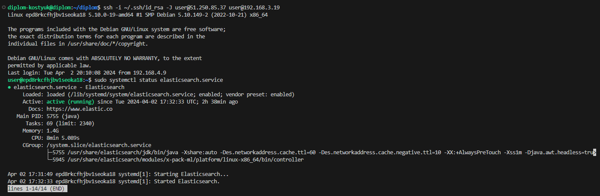

#  Дипломная работа по профессии «Системный администратор» - Денис Костюк

Содержание
==========
* [Введение](#Введение)
* [Задача](#Задача)
* [Инфраструктура](#Инфраструктура)
    * [Сайт](#Сайт)
    * [Мониторинг](#Мониторинг)
    * [Логи](#Логи)
    * [Сеть](#Сеть)
    * [Резервное копирование](#Резервное-копирование)

---------
## Введение
Как это все работает:  
На сервисе Yandex Cloud создана виртуальная машина, на которой установлены Terreform и Ansible, а также размещены файлы проекта для развертывания инфраструктуры из дипломного задания. Эта виртуальная машина работает постоянно и непрерывно, поэтому доступ к ней есть всегда. Дипломный руководитель при проверке дипломного задания может командой terraform destroy удалить инфраструктуру, а командой terraform apply запустить создание инфраструктуры "с нуля".
Доступ к виртуальной машине, с которой разворачивается инфраструктура из дипломного задания:  
ip = 51.250.69.216  
user = diplom-kostyuk  
pass = пароль в целях безопасности отправлен в сопроводительном сообщении к ссылке на результат дипломной работы.  
Интерфейс командной строки Yandex Cloud (CLI) подключен.  
  
Разворачивание инфраструктуры полностью автоматизировано, включая настройку конфигурационных файлов. Руками надо настраивать только ту часть, которая настраивается через WEB-интерфейс, а именно: Kibana и Zabbix.  
Пароль от БД Zabbix = 123456  
IP-адреса хостов (как внутренние, так и внешние) выводятся в аутпутах по результатам отработки проекта.  

Итак, подключаемся к серверу с проектом по учетным данным, приведенным выше:  

Далее идем в директорию diplom и запускаем команду terraform apply:

  
Далее yes:  

  
Через какое-то время проект отработает, на выходе в аутпутах получаем IP-адреса созданных хостов:  

  
Подключаться к серверам можно по внутренним IP через бастион пользователем user. Например, для подключения к WM-1 (виртуальная машина №1) можно испоьзовать команду: ssh -i ~/.ssh/id_rsa -J user@151.250.85.37 user@192.168.1.4, где "51.250.85.37" - это внешний IP-адрес бастиона, а "192.168.1.4" - это внутренний адрес хоста, к которому надо подключиться.  

Далее настраиваем Kibana и Zabbix через вэб-интерфейс.  

Теперь переходим к демонстрации непосредственно дипломной работы:  

## Задача
Ключевая задача — разработать отказоустойчивую инфраструктуру для сайта, включающую мониторинг, сбор логов и резервное копирование основных данных. Инфраструктура должна размещаться в [Yandex Cloud](https://cloud.yandex.com/) и отвечать минимальным стандартам безопасности: запрещается выкладывать токен от облака в git.  

## Инфраструктура
  
Инфраструктура разворачивается с помощью Terraform и Ansible.  
Инвентори-файл hosts.txt для Ansible создается автоматически и использует fqdn имена виртуальных машин:  

## Сайт

Проверяем работу балансера:  

в том числе через вэб-интерфейс:  
  
  

По внешним IP сайты vm-1 с vm-2 недоступны.  
  
Балансировщик:  
   

   
   

## Мониторинг
  
Учетная запись по умолчанию: имя пользователя - Admin, пароль — zabbix.  
Создана ВМ, на ней установлен Zabbix-сервер. На каждую ВМ установлен Zabbix Agent, настроены агенты на отправление метрик в Zabbix-сервер  
   

На дашборд выведены графики  
   

## Логи
  
Реализована ВМ, на которой установлен Elasticsearch  
  

На 2-х ВМ с вэб-серверами установлен filebeat, настроена отправка логов в Elasticsearch  
   

  
  
Создана ВМ с Kibana, сконфигурировано соединение с Elasticsearch  

## Сеть
  
Развернут один VPC. Сервера web, Elasticsearch помещены в приватные подсети. Сервера Zabbix, Kibana, application load balancer определины в публичную подсеть.  
Настроены Security Groups соответствующих сервисов на входящий трафик только к нужным портам.  
Настроен bastion host с публичным адресом.  
Подключение ansible к серверам web и Elasticsearch через данный bastion host реализовано с помощью ProxyCommand.  

## Резервное копирование

Настроено ежедневное создание snapshot дисков всех ВМ, срок жизни snapshot = 7 дней.  

